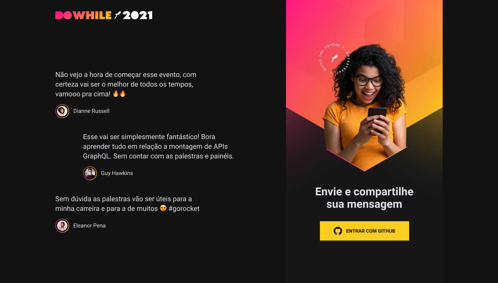

<h1 align="center">
    🚀 Next Level Week - HEAT 🚀
</h1>

<h1 align="center">
    
</h1>

  <a href="#-project">Project</a>&nbsp;&nbsp;&nbsp;|&nbsp;&nbsp;&nbsp;
  <a href="#-technologies">Technologies</a>&nbsp;&nbsp;&nbsp;|&nbsp;&nbsp;&nbsp;
  <a href="#-how-to-run">How to Run</a>&nbsp;&nbsp;&nbsp;|&nbsp;&nbsp;&nbsp;
  <a href="#-layout">Layout</a>

  
  

## 💻 Project

The objective of this project is allows people to write messages saying what their expectations about event called DOWHILE powered by ROCKETSEAT..

 

## 🛠️ Technologies

This project was developed with the following technologies:

- **Backend**
  - NodeJS
  - Typescript
  - Prisma / Prisma Studio
  - Github OAuth
  - Socket.io

- **Frontend**
  - Vite
  - ReactJS
  - Typescript
  - SASS SCSS
  - Context API

- **Mobile**
  - Expo
  - React Native
  - Typescript
  - Moti

## ⚙️ How To Run

Follow this steps below to run this project

- Clone o repository with `git clone https://github.com/viniciuslimax10/NLW-HEAT`;
- **Backend:**
  - Go to directory backend with `cd node`;
  - Install all dependencies with `yarn`;
  - Change environments variables `.env.example`;
  - Start the dev server with `yarn dev`.
- **Frontend:**
  - Go to directory front-end with `cd web`;
  - Install all dependencies with `yarn`;
  - Change file auth.tsx variable `CLIENT_ID`;
  - Start the dev server with `yarn dev`.
- **Mobile:**
  - Go to directory react-native with `cd react-native`;
  - Install all dependencies with `yarn`;
  - Change file auth.tsx variable `CLIENT_ID`;
  - Start the dev server with `expo start`.
 

## 🔖 Layout

Access the layout in [Figma](https://www.figma.com/file/K45X4ZpekMmUHVWQtyBL7R/%5BNLW-Heat---Mission%3A-Impulse%5D-DoWhile2021-(Community)-(Copy)?node-id=0%3A1).

 

